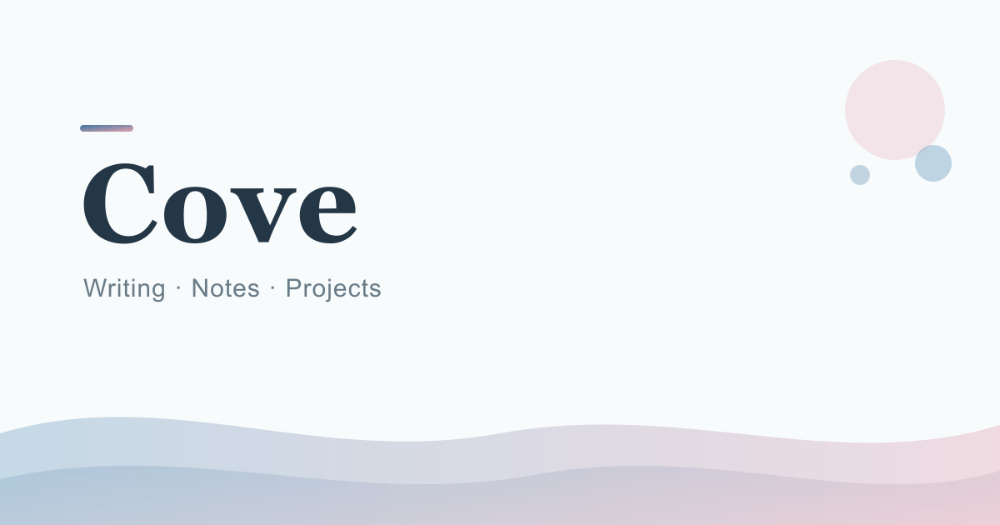

<div align="center">

# Cove

**小海湾里的文字、项目与技术分享**

个人博客与内容空间 · 以 Git 为唯一事实源 · Astro 静态构建 · 部署于 Cloudflare Workers



[线上站点](https://cove.xin) · [文章](https://cove.xin/posts/) · [笔记](https://cove.xin/notes/) · [项目](https://cove.xin/projects/) · [关于](https://cove.xin/about/) · [文档](docs/README.md)

[](https://github.com/Frozensky-palace/cove/actions/workflows/ci.yml)


</div>

## 简介

Cove 是一个面向中文写作的个人博客与内容空间：文章、笔记、项目与「值守者」角色档案
全部以 Markdown 保存在 Git 仓库中，经 Astro 构建为纯静态站点。视觉关键词是
**海雾、浅湾、晨光、纸面、呼吸感**——蓝色为主、贝壳粉点缀，低饱和、多留白。

核心取向：

- **静态优先**：普通文章页零客户端框架即可完整阅读，Vue 仅用于搜索、移动导航等局部 Island；
- **内容即代码**：Content Collections + Zod schema 在构建期校验全部 frontmatter，草稿与定时发布内容不进入任何生产路由、搜索、RSS 或 Sitemap；
- **把「别忘了」变成「过不去」**：四道构建守卫 + GitHub Actions CI + Cloudflare 独立构建，三道门禁互为备份。

## 功能特性

**内容系统**

- 文章 / 笔记 / 项目 / 值守者档案四类内容，schema 构建期校验（含 `featured` 必配封面、`updatedAt ≥ publishedAt` 等不变量）
- 草稿与未来发布日期自动隔离，「定时发布」即提前合入 frontmatter
- Pages CMS 在线写作（保存即提交仓库）与本地写作双路径，分类在 CMS 中可增删改

**阅读体验**

- 深浅双主题，View Transitions 圆形揭示切换，`prefers-reduced-motion` 全局降级
- 文章目录、系列文章、上一篇 / 下一篇、相关文章、阅读时长
- WCAG 2.2 对比度语义令牌，键盘焦点与悬停反馈对等，320px 小屏适配

**发现与互动**

- Pagefind 中文全文搜索：页头弹窗按需加载（不随首屏载入 Vue），独立搜索页支持 URL 状态与全结果分页
- 分类 / 标签 / 归档时间线 / RSS / Sitemap
- Giscus 评论（域名 allowlist、加载失败降级为邮件入口）

**SEO 与分享**

- Article / ProfilePage / Person / BreadcrumbList 结构化数据，虚构角色独立标注
- 构建期自动生成 OG 品牌分享卡（satori + resvg，输出 `dist/og/`），无需手工做图

**质量工程**

- 构建守卫链：`content-guard`（测试内容不进生产）→ `noindex-preview`（非生产分支自动 noindex）→ `dist-guard`（草稿不泄漏）→ `link-check`（站内无断链）
- GitHub Actions CI 在 `main` 与所有 PR 上运行同一套检查 + 构建链
- 推送 `main` 即由 Cloudflare Workers Builds 自动发布，支持秒级控制台回滚

## 技术栈

| 层级 | 选型 |
| --- | --- |
| 页面框架 | Astro（默认静态输出） |
| 交互 | Vue 3 Islands（仅局部组件） |
| 类型 | TypeScript（strict） |
| 样式 | Tailwind CSS v4 + CSS variables 设计令牌 |
| UI 基础 | shadcn-vue（仅复杂交互原语，按阶段添加） |
| 图标 | Lucide（16/18/20px，描边 1.75） |
| 搜索 | Pagefind（构建期索引） |
| 评论 | Giscus（GitHub Discussions） |
| CMS | Pages CMS（`.pages.yml`） |
| OG 分享图 | satori + @resvg/resvg-js（构建期） |
| 部署 | Cloudflare Workers Static Assets |
| 包管理 | pnpm |

## 快速开始

环境要求：Node.js `>= 22`、pnpm `>= 10`（可通过 `corepack enable` 启用）。

```bash
git clone https://github.com/Frozensky-palace/cove.git
cd cove
corepack enable          # 如尚未启用 pnpm
pnpm install             # 安装依赖（CI 环境用 --frozen-lockfile）
pnpm dev                 # 本地开发预览 http://localhost:4321
```

## 常用命令

| 命令 | 说明 |
| --- | --- |
| `pnpm dev` | 启动本地开发服务器 |
| `pnpm check` | 类型与内容检查（`astro check`） |
| `pnpm build` | 检查 + 生产构建 + OG 分享图 + Pagefind 索引 + 四道质量守卫 |
| `pnpm build:site` | 仅生产构建（输出 `dist/`，不含守卫链） |
| `pnpm build:search` | 单独运行 Pagefind 索引 |
| `pnpm preview` | 本地预览生产构建 |

构建守卫亦可单独运行（`pnpm guard:content` / `guard:dist` / `guard:links`），
排查说明见[运维手册](docs/OPERATIONS.md)。

## 项目结构

```text
cove/
├── .github/workflows/       # CI 质量门禁（ci.yml，不负责部署）
├── docs/                    # 开发指南、决策记录、运维手册等（索引见 docs/README.md）
├── public/                  # 静态资源（favicon、_headers 安全头、site.webmanifest）
├── scripts/                 # 构建守卫与 OG 分享图生成脚本
├── src/
│   ├── assets/              # 品牌、插画、文章/项目媒体与值守者立绘（characters/）
│   ├── components/
│   │   ├── base/            # Logo、Tag、ThemeToggle、AppSplash 等视觉原语
│   │   ├── content/         # ArticleCard、TOC、KeeperPanels、Pagination 等
│   │   ├── home/            # 首页专用区块
│   │   ├── islands/         # Vue Island（搜索弹窗/面板、移动导航）
│   │   ├── integrations/    # Giscus、Analytics 边界组件
│   │   └── navigation/      # SiteHeader、SiteFooter
│   ├── content/             # posts / notes / projects / authors / categories / milestones
│   ├── data/                # 站点信息、taxonomy 派生、集成配置
│   ├── layouts/             # BaseLayout、ContentLayout、ArticleLayout
│   ├── lib/                 # content、seo、search、urls、useSearch
│   ├── pages/               # 路由（见下）
│   └── styles/              # tokens.css、global.css、prose.css
├── astro.config.mjs
└── package.json
```

页面路由：首页、文章（分页列表 + 详情）、笔记、项目、系列、分类、标签、归档时间线、
搜索、关于、现在（/now）、值守者档案（/character）、隐私、404、RSS、Sitemap、robots.txt；
另有 `/dev/` 设计令牌展示页（始终 noindex，仅用于开发验收）。

## 部署与质量门禁

- **生产发布**：推送 `main` → Cloudflare Workers Builds 自动执行安装与完整构建链 →
  `wrangler deploy`，约 2–3 分钟生效；
- **CI 门禁**：GitHub Actions 在推送 `main` 与所有 PR 上独立运行同一套
  「检查 + 构建守卫链」，作为合并前质量门禁；
- **预览隔离**：非 `main` 分支构建自动注入 `X-Robots-Tag: noindex`，不会被搜索引擎收录。

写作发文、发布验证、回滚、季度恢复演练、依赖更新与守卫链排查的完整操作说明见
[运维手册](docs/OPERATIONS.md)。

## 文档

完整文档地图见 [`docs/README.md`](docs/README.md)，核心入口：

| 文档 | 内容 |
| --- | --- |
| [开发指南](docs/COVE-DEVELOPMENT-GUIDE.md) | 开发基线：产品定义、架构、视觉系统、内容模型、分阶段方案 |
| [决策记录](docs/decision-log.md) | IMPL-001 起逐条记录每次实施的改动、理由与验证结果 |
| [运维手册](docs/OPERATIONS.md) | 发文、发布验证、回滚、恢复演练、依赖更新 |
| [CMS 写作指南](docs/PAGES-CMS-GUIDE.md) | Pages CMS 授权、编辑与发布流程 |

## 许可

本项目为个人内容站点，未设开源许可证：代码与文章内容保留所有权利，暂不接受外部
Pull Request。引用与合作需求请通过 [关于页](https://cove.xin/about/) 所列联系方式
与作者沟通。
