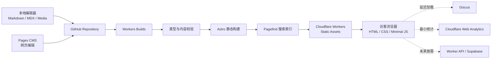

# Cove 博客开发指南

> 文档版本：1.0  
> 状态：开发实施基线  
> 更新日期：2026-09-16  
> 适用范围：Cove V1 设计、开发、内容录入、测试、部署与后续维护

## 1. 文档目的

本文档是 Cove 个人博客的后续开发指南。它将产品目标、页面设计、技术架构、内容模型、组件边界、开发顺序和验收标准放在同一个基线中，避免开发过程中出现视觉方向漂移、功能重复或架构过度扩张。

本文档基于 `docs/personal-blog-project-proposal-v2.html`，并结合已经确认的品牌方向：

- 网站名称为 **Cove**。
- 内容以文字记录、项目介绍和技术分享为主。
- 气质温柔、静谧、清爽，表达“小海湾”的安全感与留白感。
- 颜色以低饱和蓝色为主，贝壳粉为少量点缀。
- 参考旧版主页的 Cove 标志、海湾意象和蓝粉配色，但减少大幅高饱和插画、渐变堆叠、通用卡片和模板化装饰。
- 技术架构采用 Git 驱动的 Astro 静态内容系统。

除非后续有明确的新决策，开发以本文档为准。原 HTML 提案负责记录架构推导，本文档负责指导实际实施。

## 2. 产品定义

### 2.1 产品定位

Cove 是一个长期维护的个人内容空间，用于沉淀：

1. 有完整论述的文章和技术分享。
2. 较短、更新频率更高的随笔与笔记。
3. 具有过程、结果和反思的个人项目。
4. 作者介绍、研究方向和对外链接。

它首先服务内容阅读，其次服务内容发现，最后才是搜索、评论等辅助交互。

### 2.2 目标读者

- 希望了解作者近况、兴趣与长期方向的访客。
- 通过搜索引擎、RSS 或外部链接进入单篇文章的读者。
- 阅读技术文章、项目记录和实践总结的开发者。
- 未来的作者本人，用于检索和回看长期积累。

### 2.3 V1 目标

| 目标 | 可验证结果 | 优先级 |
| --- | --- | --- |
| 内容长期可保存 | 正文与媒体存于 Git，可追踪、回滚和迁移 | P0 |
| 阅读体验稳定 | 无第三方服务时仍能完整阅读所有公开内容 | P0 |
| 发布流程简单 | 本地或 Pages CMS 修改后，经 Git 自动构建发布 | P0 |
| 中文内容易发现 | 支持分类、标签、归档、RSS 和中文全文搜索 | P0 |
| 形成 Cove 视觉识别 | 首页、文章页和项目页遵守统一设计令牌 | P0 |
| 低维护成本 | V1 无数据库、自研后台和长期运行的应用服务器 | P0 |
| 可继续扩展 | 动态功能能单独加入，不改变正文事实源 | P1 |

### 2.4 V1 范围外

以下能力不进入 V1：

- 用户注册、登录和个人资料。
- 云端收藏、点赞计数和阅读历史。
- 会员、付费内容和私有文章。
- 自研 CMS、自研评论系统和内容数据库。
- 基于用户画像的个性化推荐。
- 全站 SSR、全站 Vue SPA 或通用后端 API。
- 为视觉效果引入的持续动画、3D 场景和大体积前端依赖。

## 3. 核心设计与架构原则

1. **内容优先**：视觉层级首先帮助阅读和发现内容。
2. **静态优先**：能在构建期生成的页面全部预渲染为 HTML。
3. **单一事实源**：GitHub 中的 Markdown、MDX 和媒体是公开内容的唯一事实源。
4. **按需交互**：Vue 只用于真正需要客户端状态的局部组件。
5. **渐进增强**：JavaScript、搜索、评论或统计失败时，基础导航和正文仍可使用。
6. **服务可替换**：Giscus、Analytics 和 CMS 通过边界组件或配置接入。
7. **字段先建模**：新增内容字段时同步修改 schema、CMS 配置、页面和示例内容。
8. **稳定地址**：公开 URL 不绑定发布日期；发布后避免修改 slug。
9. **克制表达**：蓝粉品牌色、插画、圆角、阴影和动效只用于建立层级。
10. **可验证交付**：每个开发阶段必须产生可运行结果和明确验收证据。

## 4. 总体架构



### 4.1 构建时发生

- 加载 Content Collections。
- 校验 frontmatter 与 TypeScript。
- 排除生产环境中的草稿。
- 生成首页、列表、详情、分类、标签、归档和项目页面。
- 处理本地图片并输出响应式资源。
- 生成 SEO 元数据、RSS、Sitemap 和结构化数据。
- 构建 Pagefind 索引。
- 检查内部链接和关键页面。
- 将 `dist/` 作为静态资产发布。

### 4.2 浏览时发生

- Cloudflare CDN 返回 HTML、CSS、图片和少量脚本。
- 主题脚本在页面绘制前恢复主题，避免闪烁。
- 用户打开搜索时加载 Pagefind 与搜索 Island。
- 用户需要查看大图时加载或激活灯箱。
- 评论区进入视口或由用户主动展开后加载 Giscus。
- Analytics 发送基础真实用户性能数据。

### 4.3 动态层引入规则

只有明确出现账号、跨设备收藏、私有内容或结构化业务数据时，才评估 Worker API 和 Supabase。公开文章仍保留在 Git 中并预渲染。任何动态服务故障均不得阻断公开正文。

### 4.4 构建与部署配置约束

- `astro.config.*` 必须设置正式 `site`，canonical、RSS、Sitemap 和绝对 Open Graph URL 均从该配置派生。
- 纯静态阶段不安装 `@astrojs/cloudflare` adapter；构建输出为 `dist/`。
- `wrangler.jsonc` 的 `assets.directory` 指向 `./dist`，`not_found_handling` 使用 `404-page`。
- Astro 的 `trailingSlash` 与 Workers Static Assets 的 HTML handling 必须采用一致策略，并用 `/posts/example`、`/posts/example/` 和 404 实际验证。
- `compatibility_date` 使用项目初始化时实际验证过的日期；升级日期作为独立变更测试，不把提案日期永久复制到配置。
- Pull Request 预览需要在 Workers Builds 中开启非生产分支构建与 preview URL。预览站点必须 `noindex`；内容敏感时再加 Cloudflare Access。

## 5. 技术栈与职责

| 层级 | 选型 | 职责 | 实施约束 |
| --- | --- | --- | --- |
| 页面框架 | Astro | 路由、布局、静态生成、内容渲染 | 默认静态输出 |
| 交互 | Vue 3 Islands | 搜索、复杂弹层、灯箱等局部状态 | 明确指定 hydration 时机 |
| 类型 | TypeScript | 配置、组件与内容查询的类型安全 | 启用 strict |
| 样式 | Tailwind CSS + CSS variables | 设计令牌、布局与响应式样式 | 不使用运行时 CSS-in-JS |
| UI 基础 | shadcn-vue（选择性采用） | Dialog、Command、Sheet、Tooltip 等复杂交互 | 组件源码纳入仓库并改为 Cove 主题 |
| 图标 | Lucide | 统一线性图标 | 常用尺寸 16/18/20px，默认描边 1.75 |
| 内容 | Markdown / MDX | 文章、笔记和项目正文 | Markdown 默认，确有组件需求时才用 MDX |
| 内容层 | Astro Content Collections | 加载、schema、类型与查询 | 无效内容阻断构建 |
| 搜索 | Pagefind | 构建期生成中文静态索引 | 仅索引主要内容 |
| 评论 | Giscus | GitHub Discussions 评论 | 延迟加载并封装适配层 |
| 统计 | Cloudflare Web Analytics | 基础流量和真实用户性能 | V1 不追踪个人画像 |
| CMS | Pages CMS | Git 文件网页编辑界面 | 与 schema 保持一致 |
| 部署 | Workers Builds + Static Assets | 预览、生产构建和全球分发 | 纯静态阶段无需 Cloudflare Astro adapter |

### 5.1 shadcn-vue 使用边界

shadcn-vue 仅用于需要完整键盘操作、焦点管理或弹层行为的 Vue Island：

- 搜索：`Command` + `Dialog`。
- 移动导航：`Sheet`。
- 主题菜单：`DropdownMenu`，也可用原生按钮实现。
- 提示信息：`Tooltip`。
- 移动文章目录：`Collapsible`。

导航、文章卡片、标签、按钮外观、首页区块、文章正文和项目展示优先使用 Astro 与语义 HTML。不得为了复用一个静态按钮而给页面加载 Vue runtime。

## 6. 推荐项目结构

```text
cove/
├── .github/
│   └── workflows/
│       └── quality.yml
├── docs/
│   ├── personal-blog-project-proposal-v2.html
│   └── COVE-DEVELOPMENT-GUIDE.md
├── public/
│   ├── _headers
│   ├── favicon.svg
│   ├── robots.txt
│   └── manifest.webmanifest
├── src/
│   ├── assets/
│   │   ├── brand/
│   │   ├── illustrations/
│   │   ├── posts/
│   │   └── projects/
│   ├── components/
│   │   ├── base/                 # Button、IconButton、Tag、Divider
│   │   ├── content/              # ArticleCard、Prose、TOC、CodeBlock
│   │   ├── home/                 # 首页专用区块
│   │   ├── islands/              # SearchDialog、Lightbox 等 Vue 组件
│   │   ├── integrations/         # Giscus、Analytics 边界组件
│   │   └── navigation/           # Header、Footer、MobileNav
│   ├── content/
│   │   ├── posts/
│   │   ├── notes/
│   │   └── projects/
│   ├── data/
│   │   └── site.ts               # 站点名称、作者、社交链接等
│   ├── layouts/
│   │   ├── BaseLayout.astro
│   │   ├── ContentLayout.astro
│   │   └── ArticleLayout.astro
│   ├── lib/
│   │   ├── content.ts            # 集中内容查询和草稿过滤
│   │   ├── seo.ts
│   │   └── urls.ts
│   ├── pages/
│   │   ├── index.astro
│   │   ├── posts/
│   │   │   ├── index.astro
│   │   │   └── [id].astro
│   │   ├── notes/
│   │   ├── projects/
│   │   ├── categories/[category].astro
│   │   ├── tags/[tag].astro
│   │   ├── archive.astro
│   │   ├── search.astro
│   │   ├── about.astro
│   │   ├── rss.xml.ts
│   │   └── 404.astro
│   ├── styles/
│   │   ├── global.css
│   │   ├── prose.css
│   │   └── tokens.css
│   └── content.config.ts
├── .pages.yml
├── astro.config.mjs
├── components.json
├── package.json
├── pnpm-lock.yaml
├── tsconfig.json
└── wrangler.jsonc
```

## 7. 信息架构与路由

### 7.1 主导航

桌面端主导航：

```text
Cove | 首页 | 文章 | 笔记 | 项目 | 关于 | 搜索 | 主题
```

分类、标签和归档属于文章发现系统，在文章列表页和页脚提供入口，不占用一级导航。移动端使用菜单按钮打开 Sheet；搜索保留为独立图标按钮。

### 7.2 路由表

| 路由 | 输出 | 页面责任 |
| --- | --- | --- |
| `/` | SSG | 品牌介绍、精选、最新文章、最近笔记、代表项目 |
| `/posts/` | SSG | 分页文章列表及内容发现入口 |
| `/posts/[id]/` | SSG | 文章正文、目录、关联内容、评论 |
| `/notes/` | SSG | 按时间排列的短笔记 |
| `/notes/[id]/` | SSG | 可分享的笔记永久链接 |
| `/projects/` | SSG | 项目索引与状态筛选 |
| `/projects/[id]/` | SSG | 项目案例、过程、成果和相关文章 |
| `/categories/[category]/` | SSG | 单一主分类聚合 |
| `/tags/[tag]/` | SSG | 横向主题聚合 |
| `/archive/` | SSG | 按年份和月份归档 |
| `/search/` | SSG + CSR | 可直接访问的搜索页与搜索结果 |
| `/about/` | SSG | 作者、Cove、关注方向和联系链接 |
| `/rss.xml` | Build-time | 已发布文章订阅源 |
| `/sitemap-index.xml` 或 `/sitemap.xml` | Build-time | 公开页面发现 |
| `/404` | SSG | 友好的迷路状态和返回路径 |

### 7.3 URL 规范

- V1 的文章、笔记和项目文件使用扁平目录；文件名是内容的规范 ID 和 URL slug 来源。
- 使用小写 ASCII、数字和连字符；中文标题可采用稳定英文或拼音 slug。
- 文章 URL 不包含发布日期。
- 发布后的文件名视为冻结。确需改名时，必须同时配置永久重定向、更新 canonical 与站内链接，并处理 Giscus pathname 映射对应的讨论。
- 标签和分类在构建时规范化大小写与空格，展示名和 URL slug 分离。
- trailing slash 策略由 Astro 配置统一，站内链接不得混用。

## 8. 视觉设计系统

### 8.1 设计方向

Cove 的视觉关键词是：**海雾、浅湾、晨光、纸面、呼吸感**。

页面应像一本安静的个人刊物。品牌感来自颜色、排版、留白和少量海岸曲线，而不是大量海洋插画。旧版主页可保留以下元素：Cove 蓝粉标志、海湾意象、白色导航和明亮基调。首页插画应降低饱和度与信息密度，并缩小为局部视觉锚点。

需要持续避免的模板化特征：

- 每个区块都放进相同的圆角白卡。
- 多处同时使用蓝粉渐变、发光边框和大阴影。
- 通用渐变占位图、无内容含义的技术照片。
- 过大的口号、搜索框或装饰插画挤压首屏内容。
- 所有元素都有悬浮上移和渐变动画。
- 为了“丰富”而加入公告栏、统计卡片和重复作者卡片。

### 8.2 色彩令牌

以下颜色是实施起点。视觉验收时可以小幅调整，但必须保持语义名称稳定。

| Token | 浅色模式 | 深色模式 | 用途 |
| --- | --- | --- | --- |
| `--background` | `#F8FBFC` | `#111A20` | 页面背景 |
| `--surface` | `#FFFFFF` | `#17232B` | 浮层与少量卡片 |
| `--surface-muted` | `#EDF4F7` | `#1D2B34` | 次级区块背景 |
| `--text` | `#243746` | `#E7EFF3` | 主文字 |
| `--text-muted` | `#687B87` | `#A9BBC5` | 摘要与元信息 |
| `--border` | `#DCE7EC` | `#30414B` | 分隔线与输入框 |
| `--cove-blue` | `#6799BD` | `#82B4D2` | 品牌主色 |
| `--cove-blue-strong` | `#3F789F` | `#9AC7DF` | 链接、焦点与选中态 |
| `--shell-pink` | `#DEA0AF` | `#D9A7B4` | 小面积点缀 |
| `--shell-pink-soft` | `#F7E8EC` | `#382A31` | 柔和状态背景 |
| `--focus` | `#2F78AA` | `#9ED7F4` | 键盘焦点环 |

约束：

- 正文和关键操作必须达到 WCAG AA 对比度。
- 贝壳粉不直接用于小号正文文字。
- 蓝粉渐变只用于品牌标志、当前导航细线或一处关键视觉。
- 错误、成功、警告使用独立语义色，不用品牌粉代替错误色。

建议 CSS 变量：

```css
:root {
  color-scheme: light;
  --background: #f8fbfc;
  --surface: #ffffff;
  --surface-muted: #edf4f7;
  --text: #243746;
  --text-muted: #687b87;
  --border: #dce7ec;
  --cove-blue: #6799bd;
  --cove-blue-strong: #3f789f;
  --shell-pink: #dea0af;
  --shell-pink-soft: #f7e8ec;
  --focus: #2f78aa;
}

.dark {
  color-scheme: dark;
  --background: #111a20;
  --surface: #17232b;
  --surface-muted: #1d2b34;
  --text: #e7eff3;
  --text-muted: #a9bbc5;
  --border: #30414b;
  --cove-blue: #82b4d2;
  --cove-blue-strong: #9ac7df;
  --shell-pink: #d9a7b4;
  --shell-pink-soft: #382a31;
  --focus: #9ed7f4;
}
```

### 8.3 排版

- UI 与导航：系统无衬线字体栈，优先保证中文一致性和加载速度。
- 正文：V1 使用系统无衬线字体；若真实文章排版验证后需要更强刊物感，再评估自托管中文字体子集。
- 代码：`ui-monospace, SFMono-Regular, Consolas, monospace`。
- 基准字号：桌面 16–18px，移动端不低于 16px。
- 正文行高：中文 `1.8–1.9`，英文 `1.7–1.8`。
- 正文行宽：约 68–76 个英文字符；中文正文容器建议 `680–760px`。
- 标题使用清晰的字号和留白建立层级，避免依靠高饱和色。

建议字号级别：

| 级别 | 桌面 | 移动 | 用途 |
| --- | --- | --- | --- |
| Display | 48–64px | 36–44px | 首页主标题，最多一处 |
| H1 | 40–52px | 32–40px | 文章和页面标题 |
| H2 | 28–34px | 25–30px | 主要章节 |
| H3 | 21–24px | 20–22px | 子章节 |
| Body | 17–18px | 16–17px | 正文 |
| UI | 14–16px | 14–16px | 导航与控件 |
| Meta | 12–14px | 12–14px | 日期、标签和辅助信息 |

### 8.4 空间、圆角与阴影

- 采用 4px 基础网格，常用间距为 8、12、16、24、32、48、64、96px。
- 页面最大宽度约 `1180–1240px`；正文宽度单独约束。
- 普通控件圆角 8–10px，浮层和重点卡片 12–16px，胶囊只用于标签或短状态。
- 普通内容主要使用分隔线和留白；阴影只用于浮层、菜单和少量重点内容。
- 卡片嵌套不超过一层。

### 8.5 图像与插画

- 首页允许一幅 Cove 专属海湾插画，采用低饱和、少细节、较大留白的构图。
- 插画不承载文字，正文信息必须保留在 HTML 中。
- 技术文章封面优先使用与文章相关的图、图表或自制视觉，不使用无关的通用电脑照片。
- 普通文章列表允许无封面；只有精选内容需要强视觉。
- 图片必须有明确尺寸，避免布局偏移。
- 信息图片提供有意义的 `alt`；纯装饰图片使用空 `alt`。

### 8.6 动效

- 常用过渡时长 120–220ms，缓动以自然减速为主。
- 悬停反馈限制为颜色、下划线、透明度或最多 2px 位移。
- 禁止循环漂浮、持续发光和大面积视差。
- `prefers-reduced-motion: reduce` 时关闭非必要动画与平滑滚动。

### 8.7 响应式布局

使用内容驱动的断点，参考：

- `< 640px`：手机单栏。
- `640–899px`：大屏手机与平板单栏。
- `900–1199px`：正文 + 可折叠辅助区。
- `>= 1200px`：允许文章正文 + 目录双栏。

移动端要求：

- 导航折叠为 Sheet。
- 首页插画位于文字下方或作为轻背景，不裁掉主体信息。
- 文章目录折叠显示。
- 点击目标至少约 44×44px。
- 代码块横向滚动，页面本身不得横向溢出。

## 9. 页面规格

### 9.1 全局页头

页头包含 Cove 标志、一级导航、搜索按钮和主题按钮。桌面端高度建议 64–72px；滚动时可以保持吸顶，但背景需要实色或轻度透明，并避免强磨砂效果。当前页面通过细线、字重或文字色表达，不使用大胶囊底色。

要求：

- 首个可聚焦元素提供“跳到主要内容”。
- 标志链接回首页并有可访问名称。
- 搜索按钮展示快捷键提示。
- 主题按钮支持浅色、深色和跟随系统。
- 移动菜单打开后锁定背景滚动并正确管理焦点。

### 9.2 首页

首页承担“作者是谁、写什么、从哪里开始读”三项任务。

推荐结构：

```text
┌────────────────────────────────────────────┐
│ 简短自我介绍与内容主张      低饱和海湾视觉 │
│ [阅读文章] [了解 Cove]                     │
├────────────────────────────────────────────┤
│ 精选文章：1 个重点 + 1~2 个简洁条目        │
├────────────────────────────────────────────┤
│ 最新文章：以标题、摘要、时间组成的列表      │
├────────────────────────────────────────────┤
│ 最近笔记：更轻、更紧凑的时间流              │
├────────────────────────────────────────────┤
│ 代表项目：最多 2~3 个                       │
├────────────────────────────────────────────┤
│ 主题入口 / RSS / 页脚                       │
└────────────────────────────────────────────┘
```

首页首屏建议高度为 360–440px。搜索不再以大型输入框占据首屏，可通过页头按钮唤起。首页不设置独立公告栏和重复作者卡片；临时公告可使用一条可关闭的轻量横幅，并需要明确业务理由。

### 9.3 文章列表页

- 顶部包含页面标题、简短说明以及分类/归档入口。
- 默认按 `publishedAt` 降序排列。
- 列表项显示标题、摘要、日期、主分类、阅读时长和少量标签。
- 封面为可选字段；无封面时不显示占位图。
- 分页优先使用构建期分页；每页建议 8–12 篇。
- 筛选导航保持普通链接，使无 JavaScript 时仍可访问。

### 9.4 文章详情页

内容顺序：

1. 主分类与面包屑（可选）。
2. 标题和描述。
3. 发布日期、实质更新日期、阅读时长。
4. 可选封面。
5. 正文与桌面端粘性目录。
6. 标签、版权或转载说明。
7. 上一篇/下一篇或返回文章列表。
8. 2–4 篇相关文章。
9. 延迟加载评论区。

正文要求：

- 标题层级连续，正文只能有一个 H1。
- 标题生成稳定锚点，并提供复制链接能力。
- 代码块显示语言、复制按钮和横向滚动。
- 表格在窄屏可横向滚动。
- 引用、提示框、脚注和图片说明有统一样式。
- 外部链接有清晰提示，但不强制全部新窗口打开。
- 阅读进度仅用一条极细的顶部线表示。

### 9.5 笔记页

笔记采用时间流或连续列表，视觉重量低于文章。每条显示日期、可选标题、正文摘要和少量标签。笔记仍有独立 URL，便于引用、搜索和分享。

### 9.6 项目页

项目列表显示名称、简述、状态、年份、技术关键词和可选封面。项目详情应回答：

- 解决了什么问题。
- 作者承担什么角色。
- 使用了什么方法与技术。
- 关键过程、结果与反思。
- 演示、源码、论文或下载地址。
- 与项目相关的文章。

项目页面不使用类似产品营销站的指标堆叠；数据只有在能说明项目成果时出现。

### 9.7 搜索

- 页头使用搜索图标唤起对话框；`/search/` 提供可直接访问的完整页面。
- 支持 `/` 或 `Ctrl/Cmd + K` 快捷键，输入框聚焦时不重复触发。
- 结果显示标题、内容类型、摘要片段和日期。
- 可以按文章、笔记、项目过滤；V1 不做多维复杂筛选。
- 空查询显示搜索提示或推荐入口；无结果提供标签/归档链接。
- Pagefind 只索引主要内容区域，排除导航、页脚、目录、相关文章和评论。
- 页面根元素设置正确 `lang`，确保中文索引使用相应语言分组。
- 正文容器使用 `data-pagefind-body`；导航、页脚、目录、相关推荐和评论使用 `data-pagefind-ignore`。标题、摘要、分类和标签按需要输出为 Pagefind metadata/filter。

### 9.8 关于页与 404

关于页介绍作者、Cove 的含义、长期主题、联系方式和 RSS。内容应真实具体，避免能力图标墙和百分比进度条。

404 页面沿用“走出海湾/迷航”的轻量文案，提供首页、文章、搜索三个明确出口，并保持全局导航可用。

## 10. 组件与 hydration 清单

| 组件 | 技术 | 默认客户端 JS | 说明 |
| --- | --- | --- | --- |
| `SiteHeader` | Astro | 无 | 桌面导航骨架 |
| `MobileNav` | Vue + Sheet | `client:media` | 仅窄屏加载 |
| `ThemeScript` | 原生内联脚本 | 极少 | 绘制前恢复主题 |
| `ThemeToggle` | Astro/原生或 Vue | 按实现决定 | 优先原生按钮 |
| `SearchDialog` | Vue + Command/Dialog | `client:idle` 或首次交互 | 加载 Pagefind |
| `ArticleCard` | Astro | 无 | 支持有/无封面变体 |
| `ArticleTOC` | Astro + 少量原生脚本 | 可选 | 当前章节高亮 |
| `CodeCopyButton` | 原生脚本 | 极少 | 渐进增强 |
| `ImageLightbox` | Vue | `client:visible` | 只在含可放大图片时渲染 |
| `CommentProvider` | Astro/原生 | 延迟第三方脚本 | 进入视口或主动展开加载 |
| `Analytics` | Integration | 第三方脚本 | 生产环境启用 |

每个 Island 在合并前回答三个问题：

1. 是否存在可靠的语义 HTML 或 CSS 实现？
2. 未加载 JavaScript 时页面是否仍能完成主要任务？
3. hydration 时机是否晚于完成主要内容绘制？

## 11. 内容模型

### 11.1 通用规则

- 每篇内容一个文件。
- V1 collection 使用扁平目录，例如 `src/content/posts/my-post.md`；媒体可按 slug 建子目录。
- `id`/slug 由文件路径产生，不在 frontmatter 重复保存 slug。
- 日期在内容中写为 `YYYY-MM-DD`，站点按 `Asia/Shanghai` 解释与展示；实现时避免直接用 UTC 序列化导致日期偏移。
- `updatedAt` 不得早于 `publishedAt`。未来发布日期视为计划发布内容，与草稿一样从生产输出中排除。
- `draft: true` 或未来发布的内容不得进入生产路由、首页、搜索、RSS 或 Sitemap；本地开发和非生产预览可以通过统一环境开关显示。
- 封面是可选项；页面必须为无封面状态设计。
- 内容类型分别建 collection，避免一个 schema 包含大量条件字段。
- 阅读时长、标题锚点和相关文章属于构建期派生数据，不写入 frontmatter。
- 分类使用集中维护的稳定 key 与中文 label 映射。标签通过同一 helper 规范化并检查 URL 碰撞，页面不得各自实现 slugify。
- Content Collections 与 Tailwind 的配置写法以项目锁定的主版本官方 API 为准，并由 `astro check` 验证，避免复制过期示例。

### 11.2 Posts

| 字段 | 类型 | 必填 | 说明 |
| --- | --- | --- | --- |
| `title` | string | 是 | 文章与默认 SEO 标题 |
| `description` | string | 是 | 文章摘要，建议 40–160 个中文字符 |
| `publishedAt` | date | 是 | 首次公开时间 |
| `updatedAt` | date | 否 | 仅实质更新时填写 |
| `category` | string | 是 | 单一主分类 |
| `tags` | string[] | 是 | 建议 1–5 个，最大 8 个 |
| `draft` | boolean | 是 | 默认 true |
| `featured` | boolean | 否 | 首页精选，默认 false |
| `lang` | enum | 是 | `zh-CN` 或 `en` |
| `cover` | image | 否 | 本地图片 |
| `coverAlt` | string | 条件必填 | 有信息含义的封面需要填写 |
| `canonicalURL` | URL/null | 否 | 转载时指向原始地址 |
| `series` | string | 否 | 系列标识，V1 可保留字段但不强制展示 |

### 11.3 Notes

| 字段 | 类型 | 必填 | 说明 |
| --- | --- | --- | --- |
| `title` | string | 否 | 无标题笔记使用日期和正文开头展示 |
| `publishedAt` | date | 是 | 发布时间 |
| `updatedAt` | date | 否 | 实质更新时间 |
| `tags` | string[] | 否 | 0–5 个 |
| `draft` | boolean | 是 | 默认 true |
| `lang` | enum | 是 | 默认 `zh-CN` |

### 11.4 Projects

| 字段 | 类型 | 必填 | 说明 |
| --- | --- | --- | --- |
| `title` | string | 是 | 项目名称 |
| `summary` | string | 是 | 一句话介绍 |
| `status` | enum | 是 | `active`、`completed`、`archived` |
| `startedAt` | date | 否 | 开始时间 |
| `completedAt` | date | 否 | 完成时间 |
| `stack` | string[] | 否 | 技术关键词 |
| `cover` | image | 否 | 项目主图 |
| `featured` | boolean | 否 | 首页展示 |
| `draft` | boolean | 是 | 默认 true |
| `links` | object[] | 否 | `label`、`url`、`type` |
| `relatedPosts` | string[] | 否 | 相关文章 ID；实现前需校验引用存在 |

### 11.5 内容查询

所有页面通过 `src/lib/content.ts` 获取内容，不在各页面重复过滤逻辑。至少提供：

- `getPublishedPosts()`
- `getFeaturedPosts()`
- `getPublishedNotes()`
- `getPublishedProjects()`
- `getPostsByCategory()`
- `getPostsByTag()`
- `getRelatedPosts()`

生产过滤、排序和 ID 规范化必须在这些函数中集中处理。预览草稿需要明确的开发环境开关，不得依赖页面作者自行记住过滤。

建议将发布判断集中成一个纯函数，例如 `isPublicContent(entry, buildContext)`：生产环境同时过滤草稿与未来日期；本地开发和非生产分支允许显示草稿，并在页面顶部显示醒目的“预览内容”标记。预览判断可读取构建环境变量，但不得在页面模板里散落分支名称判断。

## 12. Pages CMS 约定

- `.pages.yml` 位于仓库根目录。
- CMS 字段必须与 Content Collections schema 同步。
- 文件名作为 URL slug。创建时显示文件名输入，只允许小写 ASCII、数字和连字符。
- 建议使用 Pages CMS 的 filename object：模板基于主字段，`field: create`，创建时由作者确认稳定文件名。
- `body` 使用 Pages CMS 的特殊正文键，不进入 frontmatter。
- 默认新内容 `draft: true`。
- Pages CMS 只负责普通 Markdown；含组件的 MDX 保持本地编辑，避免富文本编辑器改写组件语法。
- 上传媒体优先使用安全文件名。V1 的扁平内容目录允许 `src/assets/posts` 对文章写入 `../../assets/posts/...`；正式接入前仍需用一篇测试文章验证 `media.input`、`media.output` 与 Astro `image()` schema 是否兼容。
- CMS schema 应覆盖全部可编辑 frontmatter；同时启用 `settings.content.merge: true`，避免尚未展示在表单中的受管字段被保存操作删除。
- CMS 保存后必须触发与本地写作相同的检查和构建链。
- CMS 未接入前不阻塞本地写作和站点上线。

推荐策略示意：

```yaml
settings:
  content:
    merge: true

media:
  input: src/assets/posts
  output: ../../assets/posts
  rename: safe
  extensions: [jpg, jpeg, png, webp, avif, gif]

content:
  - name: posts
    label: 文章
    type: collection
    path: src/content/posts
    format: yaml-frontmatter
    exclude: ["*.mdx"]
    filename:
      template: "{primary}.md"
      field: create
    view:
      primary: title
      fields: [title, publishedAt, category, draft]
      sort: [publishedAt, title]
      default:
        sort: publishedAt
        order: desc
    fields:
      - { name: title, label: 标题, type: string, required: true }
      - { name: description, label: 摘要, type: text, required: true }
      - { name: publishedAt, label: 发布时间, type: date, required: true }
      - { name: updatedAt, label: 更新时间, type: date }
      - { name: category, label: 分类, type: string, required: true }
      - { name: tags, label: 标签, type: string, list: true }
      - { name: draft, label: 草稿, type: boolean, default: true }
      - { name: featured, label: 首页精选, type: boolean, default: false }
      - { name: lang, label: 语言, type: string, required: true, default: zh-CN }
      - { name: cover, label: 封面, type: image }
      - { name: coverAlt, label: 封面替代文本, type: string }
      - { name: canonicalURL, label: 原始规范地址, type: string }
      - { name: series, label: 系列, type: string }
      - { name: body, label: 正文, type: rich-text }
```

说明：以上为实施方向，Phase 6 必须用当前 Pages CMS 版本验证字段语法与媒体输出，不能直接把示意配置当作已验证成品。

## 13. SEO、分享与内容发现

### 13.1 每页元数据

- 唯一 `<title>` 与 description。
- 规范地址 canonical。
- Open Graph 和 X Card。
- 默认社交分享图；文章有封面时按规则生成或使用封面。
- 正确的 `html lang`。
- 预览环境、草稿和非正式域名设置 `noindex`。

### 13.2 结构化数据

- 全站作者使用 `Person`。
- 文章页使用 `BlogPosting`。
- 面包屑存在时使用 `BreadcrumbList`。
- JSON-LD 数据必须来自内容 schema 和站点配置，避免页面中手写重复信息。

### 13.3 相关文章

V1 使用确定性构建期算法：

1. 同分类加权。
2. 重合标签加权。
3. 排除当前文章和草稿。
4. 分数相同时优先较新内容。
5. 最多展示 4 篇。

不引入行为追踪或在线推荐服务。

## 14. 性能预算

以下是 V1 目标，不以单次实验室分数代替真实体验：

| 项目 | 目标 |
| --- | --- |
| 普通文章初始 JS | 尽可能接近 0；无 Island 时不加载 Vue runtime |
| 首页初始 JS | 只包含主题与必要导航逻辑 |
| LCP | 真实用户 P75 目标低于 2.5s |
| CLS | 目标低于 0.1 |
| INP | 真实用户 P75 目标低于 200ms |
| Lighthouse | Performance、Accessibility、Best Practices、SEO 建议均 ≥ 90 |
| 图片 | 提供尺寸、响应式来源、现代格式和懒加载策略 |
| 第三方脚本 | 评论延迟；统计仅生产加载 |

任何新增依赖需要说明：解决的问题、客户端体积、是否可树摇、是否有 Astro/原生替代方案。

## 15. 可访问性要求

- 语义区域完整：header、nav、main、article、aside、footer。
- 页面只有一个 H1，标题级别连续。
- 所有交互可由键盘完成，并有清晰 `:focus-visible`。
- 图标按钮有可访问名称；装饰图标隐藏于辅助技术。
- 搜索对话框、移动菜单和灯箱正确管理焦点与 Escape。
- 颜色不是表达状态的唯一方式。
- 正文和 UI 文字满足 WCAG AA 对比度。
- 表单输入有 label、错误说明和状态关联。
- 尊重系统主题、字体缩放和 reduced motion。
- 在 200% 浏览器缩放下，不丢失内容或关键操作。

## 16. 安全、隐私与恢复

- GitHub 启用 MFA，Pages CMS App 只授权目标仓库。
- 仓库、客户端代码、日志和示例文件不保存密钥。
- 依赖锁文件必须提交；依赖更新经预览环境验证。
- CSP 按实际生产资源收紧，不机械复制模板。
- 设置 HSTS、Referrer-Policy、Permissions-Policy 和 X-Content-Type-Options；只有所有子域均确认使用 HTTPS 后才为 HSTS 启用 `includeSubDomains`。
- Giscus 与 Analytics 的域名加入最小 allowlist。
- 预览域名和 `workers.dev` 别名禁止索引。
- 定期把仓库镜像到本地、NAS 或第二远端。
- 回滚优先恢复到上一已知成功 commit 并重新部署。
- 上线后每季度进行一次“从空目录安装、构建、预览”的恢复演练。

纯 Static Assets 的响应头可以通过 `public/_headers` 管理。未来如果加入 Worker 生成响应，必须在 Worker 代码中为相应响应补齐安全头，并重新用浏览器控制台和实际 CSP 报告验证 Giscus、Analytics、图片与字体资源。

## 17. 开发与发布工作流

### 17.1 本地开发

```text
创建/编辑内容或代码
→ 本地开发预览
→ 类型与内容检查
→ 生产构建
→ Pagefind 索引
→ 关键页面检查
→ commit / Pull Request
```

建议脚本：

```json
{
  "scripts": {
    "dev": "astro dev",
    "check": "astro check",
    "build:site": "astro build",
    "build:search": "pagefind --site dist",
    "build": "astro check && astro build && pagefind --site dist",
    "preview": "astro preview"
  }
}
```

Pagefind 必须作为 `astro build` 之后的同一条发布命令执行，并锁定 npm wrapper 版本。CI 在构建后断言 `dist/pagefind/` 存在，防止站点成功发布却缺少搜索索引。通过 npm/npx 安装时使用其包含中文分词能力的 extended binary，无需寻找名为“Pagefind Extended”的独立包。

### 17.2 Git 约定

- `main` 是生产分支。
- 标准流程为：功能/内容分支 → Pull Request → 预览环境 → 合并 `main` → 生产发布；`main` 开启分支保护，不作为日常直接编辑入口。
- 紧急修正也使用小型 Pull Request，保留检查与预览证据。
- 文章与其媒体作为一个原子变更提交。
- 不提交 `dist/` 和 Pagefind 构建产物，除非部署平台明确要求。
- 重命名已发布内容时，同一变更中加入重定向。
- Pages CMS 选择非生产内容分支进行编辑，保存后进入同一 Pull Request 流程。若当前 CMS 流程只能直写 `main`，只允许保存 `draft: true` 的内容，且该模式不视为已经具备线上草稿预览。

### 17.3 CI/CD 门禁

| 触发 | 环境 | 检查 | 失败处理 |
| --- | --- | --- | --- |
| Pull Request | Preview | 安装、check、build、Pagefind、链接检查、关键路由 smoke test | 阻止合并 |
| Push `main` | Production | 完整构建并部署自定义域名 | 保留上一成功版本 |
| 依赖更新 PR | Preview | 全部门禁 + 关键页面人工检查 | 不自动合并破坏性升级 |
| 定期维护 | Maintenance | 链接、依赖、备份和恢复检查 | 创建维护任务 |

非生产构建可显示带“预览内容”标记的草稿和计划发布内容，生产构建必须过滤它们。构建环境识别集中封装，可使用 Workers Builds 提供的分支环境变量，不允许各页面自行判断分支名称。

### 17.4 发布与回滚

- 发布前确认自定义域名、canonical、robots、Giscus repo 和 Analytics 环境。
- 发布后检查首页、文章页、搜索、RSS、Sitemap 和 404。
- 发生严重问题时，先回退到上一成功 commit；修复通过预览后再发布。
- 内容误发同样通过 Git revert 或修正 commit 处理，保留历史。

## 18. 测试策略

### 18.1 每次变更的基础检查

- 使用仓库固定的 Node、pnpm 与锁文件进行冻结安装。
- 格式化、lint 和 `astro check` 无错误。
- 生产构建成功。
- 所有内容 schema 通过。
- 内容不变量通过：ID/URL 唯一，taxonomy 无碰撞，日期顺序正确，有封面时具备 `coverAlt`，canonical 合法，关联内容 ID 存在。
- 草稿和未来内容未进入生产路由与索引。
- `astro build` 后 Pagefind 成功，且 `dist/pagefind/` 存在。
- 新增内部链接有效。
- 修改页面在手机与桌面宽度下可使用。

### 18.2 关键路径检查

1. 从首页打开文章并返回列表。
2. 通过分类、标签和归档找到内容。
3. 使用中文关键词搜索标题和正文。
4. 键盘打开、使用并关闭搜索和移动菜单。
5. 切换主题并刷新页面，主题保持且无明显闪烁。
6. 打开含代码、表格、图片和脚注的文章。
7. 第三方评论被阻止时继续阅读正文。
8. 访问不存在的 URL，从 404 返回有效页面。

### 18.3 浏览器与设备基线

- 当前稳定版 Chrome、Edge、Firefox、Safari。
- iOS Safari 与 Android Chrome 的常见手机宽度。
- 键盘导航和屏幕阅读器基础检查。
- 360px 窄屏、768px 平板、1440px 桌面。

自动化测试优先覆盖内容过滤、路由生成、SEO 输出和关键交互；不为静态样式编写脆弱的实现细节测试。

外部链接检查、依赖审计、Lighthouse 趋势和备份镜像适合定时运行，避免外部网络短暂波动阻塞每个 Pull Request。正式发布前仍需在生产域名核对 canonical、OG、RSS、Sitemap、404 状态码、安全头与预览环境 `noindex`。

## 19. 分阶段开发方案

阶段按依赖顺序执行。时间是单人开发的粗略工作量参考，不作为固定承诺。每个阶段完成验收后再进入下一阶段。

### Phase 0：项目基线与设计准备（0.5–1 天）

**目标**：把本指南转化为仓库可执行约束。

任务：

- 初始化或确认 Git 仓库状态与包管理器。
- 建立 README、开发命令和环境要求。
- 确认 Cove 标志源文件、作者名称、站点简介、社交链接和正式域名占位。
- 收集 3–5 篇真实文章、1–2 条笔记、1–2 个项目作为开发内容。
- 建立决策记录，记录后续对本文档的变更。

交付物：

- 可复现的本地环境说明。
- 真实测试内容清单。
- 品牌资产目录。

验收：

- 新环境能按 README 安装依赖。
- 核心内容和品牌资产不再依赖临时占位文本。

### Phase 1：工程骨架与设计令牌（1–2 天）

**目标**：得到一个可构建、可响应、具有 Cove 基础视觉的空站点。

任务：

- 配置 Astro、TypeScript、Tailwind 和 Vue integration。
- 初始化 shadcn-vue，但只添加当前阶段真正使用的组件。
- 建立目录、路径别名、全局样式与 CSS variables。
- 实现 `BaseLayout`、页头、页脚、跳转主内容和基础 SEO。
- 实现浅色、深色、系统主题和防闪烁脚本。
- 创建基础 Button、IconButton、Tag、Divider 视觉原语。

交付物：

- 首页空壳、404 空壳和组件展示页或临时开发页面。
- 浅色与深色设计令牌。

验收：

- `astro check` 与 production build 成功。
- 360px 到 1440px 无水平溢出。
- 主题刷新后保持，键盘焦点清晰。
- 静态页面不因 UI 库加载不必要的 Vue runtime。

### Phase 2：内容系统（2–3 天）

**目标**：真实文章、笔记和项目可被类型安全地加载与构建。

任务：

- 创建 posts、notes、projects collections 与 schema。
- 实现集中内容查询、草稿过滤、排序和 ID 规范化。
- 确定分类、标签和日期格式化规则。
- 建立图片目录和 Astro 图片处理约定。
- 录入 Phase 0 的真实内容与富文本测试文章。
- 验证草稿不会进入生产输出。

交付物：

- `src/content.config.ts`。
- 三类真实内容样本。
- `src/lib/content.ts`。

验收：

- 无效 frontmatter 会使构建失败并给出明确错误。
- 草稿不出现在生成路由。
- 示例文章覆盖标题、列表、引用、代码、表格、图片和脚注。

### Phase 3：首页与核心阅读体验（4–6 天）

**目标**：形成可以独立评审的 Cove 核心产品体验。

任务：

- 实现首页 Hero、精选文章、最新文章、最近笔记和代表项目。
- 实现文章列表、分页和文章详情。
- 实现正文排版、TOC、标题锚点、代码复制、图片说明和响应式表格。
- 实现项目列表、项目详情、笔记列表和笔记详情。
- 实现相关文章与上一篇/下一篇。
- 完成移动导航和所有核心空状态。
- 使用真实内容校正颜色、密度、行宽、封面比例与响应式布局。

交付物：

- 可完整浏览的核心站点。
- 首页、文章页和项目页的桌面/移动实现。

验收：

- 首页首屏能说明 Cove 是什么并出现真实内容入口。
- 无封面内容不会显示通用占位图。
- 普通文章在禁用 JavaScript 时可完整阅读和导航。
- 正文在手机与桌面均有舒适行宽和字号。
- 页面没有重复作者卡、无意义公告卡或卡片套卡片。

### Phase 4：内容发现与搜索（2–4 天）

**目标**：读者能通过不同路径找到内容。

任务：

- 实现分类、标签和年度归档页。
- 生成 RSS 与 Sitemap。
- 接入 Pagefind 构建步骤。
- 实现 `/search/` 和搜索对话框。
- 支持中文查询、类型过滤、键盘快捷键、空状态与无结果状态。
- 标记 Pagefind 的包含与排除区域。

交付物：

- 完整内容发现系统。
- 可搜索中文标题与正文的静态索引。

验收：

- 中文关键词能命中测试文章。
- 导航、页脚、目录和评论不污染搜索摘要。
- 草稿不进入 Pagefind、RSS 和 Sitemap。
- 无 JavaScript 时分类、标签、归档和文章列表仍可使用。

### Phase 5：SEO、分享与可访问性（2–3 天）

**目标**：关键页面具备可靠的搜索、分享和无障碍基础。

任务：

- 完成 canonical、Open Graph、X Card 和默认分享图。
- 输出 Person、BlogPosting 和可选 BreadcrumbList JSON-LD。
- 完成 about、404、robots 与 manifest。
- 检查标题层级、键盘操作、焦点、对比度、alt 和 reduced motion。
- 验证 200% 缩放与常见移动宽度。

交付物：

- SEO helper 与统一 head 输出。
- 可访问性检查记录。

验收：

- 每个公开页面具有唯一 title、description 与 canonical。
- 键盘可完成导航、搜索、主题切换和移动菜单操作。
- Lighthouse 四项建议分数均达到 90 以上，已知偏差有记录。

### Phase 6：CMS 与外部集成（2–4 天）

**目标**：打通网页写作、评论和统计，同时保持正文独立。

任务：

- 配置 Pages CMS 的三类内容与媒体。
- 验证 CMS 文件名、frontmatter、正文与图片路径。
- 从 CMS 新建草稿、提交并触发预览构建。
- 配置 Giscus repo、category、pathname 映射与主题同步。
- 实现评论延迟加载和失败占位。
- 仅在生产环境接入 Cloudflare Web Analytics。

交付物：

- `.pages.yml`。
- `CommentProvider` 和 Analytics 边界组件。
- CMS 写作与发布说明。

验收：

- 不打开本地编辑器也能创建一篇草稿并得到预览。
- CMS 生成的内容通过 schema 和生产构建。
- 阻止 Giscus 或 Analytics 后，正文和导航不受影响。
- 第三方脚本符合 CSP allowlist。

### Phase 7：部署、质量门禁与上线（2–3 天）

**目标**：建立可回滚的持续发布闭环。

任务：

- 配置 Workers Static Assets 与 Workers Builds。
- 为 Pull Request 配置预览环境。
- 配置 check、build、Pagefind、链接检查和 smoke test。
- 添加安全头、预览环境 noindex 与正式域名 canonical。
- 检查自定义域名、HTTPS、RSS、Sitemap、404、评论和统计。
- 编写发文、回滚、恢复和依赖更新文档。
- 执行首次空环境恢复演练。

交付物：

- 生产站点与预览环境。
- CI/CD 配置和运维说明。
- 上线验收记录。

验收：

- Pull Request 失败时不能进入生产。
- Push 到 `main` 能完成生产发布。
- 上一成功版本可恢复。
- 从空目录按文档能完成安装、构建和预览。
- V1 完成定义全部满足。

### Phase 8：上线观察与后续迭代（持续）

**目标**：依据真实内容和使用情况调整产品。

上线后 2–4 周观察：

- 哪些入口真正带来文章阅读。
- 搜索词是否能得到正确结果。
- 首页精选和最新内容的点击分布。
- Core Web Vitals 与第三方脚本影响。
- Pages CMS 是否改善写作流程。
- 评论、笔记和项目页是否真的被使用。

只有当真实信号出现时才评估后续功能。例如，跨设备收藏需求持续存在后再评估账户与数据库；媒体仓库体积或构建时间达到明确问题后再评估 R2。

## 20. V1 完成定义

以下条件同时满足，V1 才算完成：

- 首页、文章、笔记、项目、分类、标签、归档、搜索、关于和 404 均有完成态。
- 至少 3–5 篇真实文章、1–2 条笔记、1–2 个真实项目用于验证。
- 所有内容 schema、类型检查、构建和内部链接通过。
- 草稿不会出现在任何生产页面、搜索、RSS 或 Sitemap。
- 中文搜索可以检索标题和正文。
- 普通文章无需客户端框架即可完整阅读。
- 深浅主题、移动端、键盘操作和 reduced motion 已验证。
- SEO、RSS、Sitemap、结构化数据和分享预览已验证。
- Pages CMS、Giscus 和 Analytics 在生产配置下可用，失效时不影响正文。
- PR 预览、生产部署、回滚和空环境恢复流程已验证。
- README 和运维文档说明写作、发文、回滚、恢复与依赖更新。

## 21. 变更管理与开发约束

### 21.1 修改内容字段

按以下顺序同步修改：

1. Content Collections schema。
2. `.pages.yml`。
3. TypeScript 类型与查询函数。
4. 页面和组件。
5. 示例内容与测试。
6. 迁移现有内容。

### 21.2 新增依赖

Pull Request 中说明：

- 要解决的具体问题。
- 是否进入客户端 bundle。
- 大致体积和 tree-shaking 情况。
- 原生 HTML/CSS、Astro 或现有依赖为何不足。
- 移除或替换依赖时的影响。

### 21.3 新增动态能力

在引入 API、数据库或认证之前，必须记录：

- Git 或浏览器本地存储为何无法满足需求。
- 数据所有权、导出、隐私和备份方案。
- 缓存与故障边界。
- 动态服务失效时公开内容的行为。
- 引入后的运行成本和维护责任。

### 21.4 Agent 协作规则

- 先阅读本文档与相关源文件，再修改实现。
- 不为文章 CRUD 引入数据库或自研后台。
- 不把静态页面改造成 Vue SPA。
- 不绕过 schema 读取任意 frontmatter。
- 不把 Giscus、Analytics 等第三方实现写死到文章模板深处。
- 不只修改构建产物；所有修改都落到源文件。
- 交付时说明变更文件、架构影响、验证结果和回滚方式。

## 22. 未来扩展阈值

| 真实需求信号 | 可评估能力 | 前置条件 |
| --- | --- | --- |
| 多设备身份与私有资料 | Supabase Auth | 明确身份价值和隐私边界 |
| 跨设备收藏、点赞、阅读历史 | Supabase Postgres + RLS | 本地存储已不能满足 |
| 私有或会员内容 | Worker 鉴权 + Supabase | 完成缓存、泄露与合规设计 |
| 仓库媒体显著拖慢克隆或构建 | Cloudflare R2 | 有体积和构建时间数据 |
| 大量非 GitHub 用户需要评论 | 可替换评论服务 | 有审核、反垃圾和备份方案 |
| 稳定订阅需求 | 专业邮件服务 + Worker 表单 | 完成确认订阅、退订和隐私说明 |
| 内容量导致构建持续超时 | 远程 loader 或局部动态路由 | 先有构建耗时与内容规模证据 |

无论采用哪种扩展，公开文章、笔记和项目的原始内容继续保存在 Git 中。

## 23. 实施决策记录

当前默认决策如下：

| 编号 | 决策 | 状态 |
| --- | --- | --- |
| ADR-001 | Git + Markdown/MDX 是内容唯一事实源 | 已确认 |
| ADR-002 | Astro 静态输出为默认渲染模式 | 已确认 |
| ADR-003 | Vue 只用于局部 Islands | 已确认 |
| ADR-004 | 使用 Tailwind 与 Cove 自定义设计令牌 | 已确认 |
| ADR-005 | shadcn-vue 仅用于复杂交互原语 | 已确认 |
| ADR-006 | 蓝色为主、贝壳粉点缀，整体低饱和 | 已确认 |
| ADR-007 | 文件路径是 URL slug 来源，不重复保存 slug frontmatter | 实施默认 |
| ADR-008 | 搜索使用 Pagefind，评论使用 Giscus | 已确认 |
| ADR-009 | Cloudflare Workers Static Assets 负责发布 | 已确认 |
| ADR-010 | Pages CMS 在核心阅读体验完成后接入 | 实施默认 |

后续若修改已确认决策，应在本节增加新的 ADR 条目，写明原因、影响范围和迁移方案，而不是直接覆盖历史判断。

## 24. 参考基线

- `docs/personal-blog-project-proposal-v2.html`
- [Astro Content Collections](https://docs.astro.build/en/guides/content-collections/)
- [Astro Vue Integration](https://docs.astro.build/en/guides/integrations-guide/vue/)
- [shadcn-vue Astro 安装](https://www.shadcn-vue.com/docs/installation/astro)
- [Pages CMS 配置](https://pagescms.org/docs/configuration/)
- [Pages CMS Filename](https://pagescms.org/docs/configuration/content/filename/)
- [Pages CMS Media](https://pagescms.org/docs/configuration/media/)
- [Pagefind 多语言搜索](https://pagefind.app/docs/multilingual/)
- [Pagefind 安装与 extended binary](https://pagefind.app/docs/installation/)
- [Giscus](https://giscus.app/zh-CN)
- [Cloudflare Workers Static Assets](https://developers.cloudflare.com/workers/static-assets/)
- [Cloudflare Workers Builds](https://developers.cloudflare.com/workers/ci-cd/builds/)
