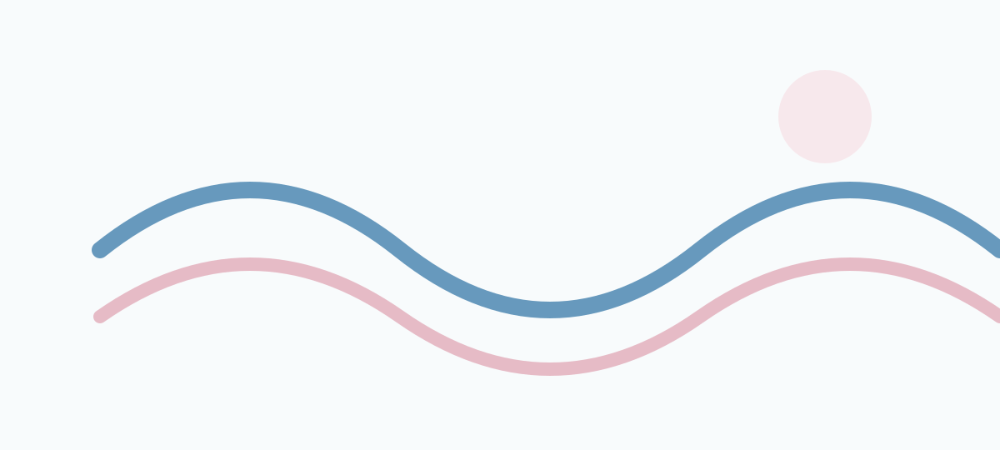

这篇文章是 Cove 正文样式的"试金石"：所有常用内容元素都出现在这里，任何样式改动后都应过一遍本文。

## 标题层级

H2 之下是 H3，H3 之下是 H4，层级保持连续。

### 三级标题

段落文本使用系统无衬线字体，正文行高 1.8，容器宽度约 720px，保证舒适的阅读行宽。**加粗**、*斜体*、`行内代码` 与[站内链接](/posts/)、[外部链接](https://developer.mozilla.org/zh-CN/) 混排时基线应对齐。

#### 四级标题

四级标题用于极少数需要细分的场合。

## 列表

无序列表：

- 低饱和蓝是 Cove 的主色；
- 贝壳粉作为强调与点缀；
- 焦点环使用更深的蓝色。

有序列表：

1. 内容写为 Markdown 文件；
2. 构建期校验 frontmatter；
3. 生成静态页面与搜索索引。

## 引用

> 引用块应有明显的左侧边界与更安静的文本颜色，不使用大面积底色。
>
> 多段引用之间保留段落间距。

## 代码

行内代码如 `npm run build`。代码块显示语言、等宽字体、横向滚动与复制按钮：

```ts
import { defineConfig } from 'astro/config';

export default defineConfig({
  site: 'https://cove.example.com',
  trailingSlash: 'always',
});
```

长行代码不得撑破容器，应当出现横向滚动而不是折行 `const veryLongVariableName = '这一行故意写得很长很长的目的是验证 pre 块的横向滚动行为是否正确生效';`：

```ts
const configuration = { site: 'https://cove.example.com', trailingSlash: 'always', integrations: [], markdown: { shikiConfig: { themes: { light: 'github-light', dark: 'github-dark' } } } };
```

Shell 代码块：

```bash
pnpm install
pnpm build
```

## 表格

| 令牌 | 浅色值 | 用途 |
| --- | --- | --- |
| `--cove-blue` | `#6799bd` | 主色，选区与装饰 |
| `--cove-blue-strong` | `#3f789f` | 强调，链接与主按钮 |
| `--shell-pink` | `#dea0af` | 点缀色 |

窄屏下表格容器允许横向滚动。

## 图片

带说明的正文图片（figure + figcaption）：



图片必须有明确尺寸避免布局偏移；信息图片提供有意义的 alt。

## 脚注

脚注用于补充而不打断正文[^1]，另一个脚注验证编号与回链[^note]。

[^1]: 脚注区域与正文之间有分隔线，字号略小。
[^note]: 点击脚注编号可跳到脚注区，脚注区提供返回链接。

## 分隔线

---

前后留白一致的 `<hr>`。

## 检查清单

- [x] 标题层级连续
- [x] 代码块语言与复制按钮
- [x] 表格窄屏滚动
- [x] 图片说明与 alt
- [x] 脚注编号与回链
